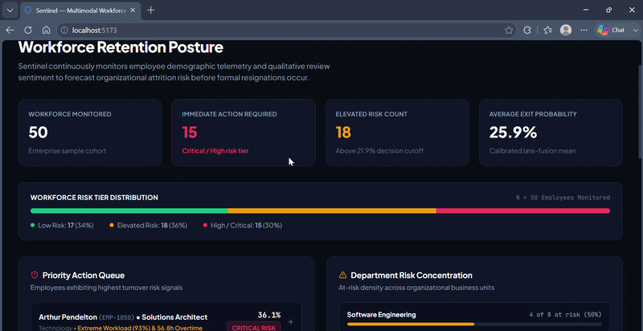
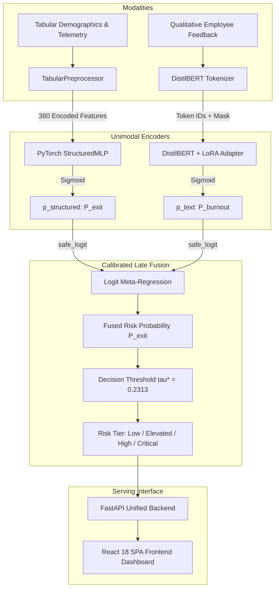

# Sentinel: Multimodal Workforce Risk Intelligence Platform

[](https://www.python.org/downloads/)
[](https://react.dev/)
[](https://www.typescriptlang.org/)
[](https://opensource.org/licenses/MIT)
[](https://huggingface.co/ParminderzHuggingFace/sentinel-workforce-risk-models)
[](https://www.kaggle.com/code/parmindersingh2002/workforce-risk-ml-gpu-training)

**Sentinel** is an enterprise multimodal machine learning platform designed to predict voluntary employee attrition and workplace burnout risk. By combining high-dimensional structured telemetry (compensation, tenure, performance, overtime, promotions) with qualitative employee feedback text, Sentinel captures organizational attrition patterns alongside subjective psychological distress signals through calibrated late fusion.

---

## Demo



---

## 1. Problem & Multimodal Rationale

Enterprise workforce turnover imposes significant replacement and institutional knowledge costs. Traditional attrition prediction models rely exclusively on structured HR databases (e.g. salary, tenure, satisfaction ratings), which often miss qualitative signals of team friction or burnout. Conversely, text feedback alone lacks concrete compensation and demographic context.

Sentinel implements a **calibrated multimodal late-fusion architecture** that processes structured HR records through a PyTorch Deep Neural Network while processing unstructured review text through a fine-tuned DistilBERT transformer with Low-Rank Adaptation (LoRA).

---

## 2. High-Level Architecture



---

## 3. Machine Learning Pipeline Details

### 3.1 Structured Tabular Model (`StructuredMLP`)
- **Input Dimension**: 380 features (24 continuous numerical metrics + 356 one-hot encoded categorical dimensions).
- **Topology**: `[380 -> 128 -> 64 -> 32 -> 1]` with BatchNorm1d, ReLU, and Dropout(0.20).
- **Target**: Voluntary company departure (`left_company`).
- **Holdout Test Metrics ($N = 85,096$)**: **ROC-AUC: 0.5755**, **PR-AUC: 0.3313**, **Recall at $\tau = 0.2469$: 84.70%**.

### 3.2 NLP Text Model (`DistilBERT` + PEFT/LoRA)
- **Base Architecture**: `distilbert-base-uncased` (66M parameters).
- **LoRA Configuration**: Rank $r=16$, $\alpha=32$, target modules `q_lin`, `v_lin`, dropout 0.05.
- **Target**: High burnout risk indicator (`high_burnout_risk`).
- **Holdout Test Metrics ($N = 85,197$)**: **ROC-AUC: 0.7363**, **PR-AUC: 0.7565**, **Recall at $\tau = 0.3530$: 86.46%**.

### 3.3 Multimodal Late Fusion
- **Meta-Classifier**: Calibrated Logistic Meta-Regression operating on boundary-clamped log-odds:
  $$\text{logit}(P_{\text{exit}}) = 0.0094 + 1.0471 \cdot \text{logit}(P_{\text{structured}}) + 0.0272 \cdot \text{logit}(P_{\text{burnout}})$$
- **Operating Decision Threshold**: $\tau^* = 0.2313$.
- **Aligned Dual Holdout ($N = 8,463$)**: **ROC-AUC: 0.5719**, **PR-AUC: 0.3387**, **Recall: 86.60%** (2,113 / 2,440 true departures captured).

### 3.4 Risk Tier Classification

| Risk Tier | Probability Range | Strategic Operational Action |
| :--- | :---: | :--- |
| **LOW** | $P < 0.2313$ | Standard annual retention monitoring and career development. |
| **ELEVATED** | $0.2313 \le P < 0.45$ | Exceeds optimal decision threshold; schedule 1-on-1 check-in. |
| **HIGH** | $0.45 \le P < 0.70$ | Elevated departure risk; review compensation, workload, and growth. |
| **CRITICAL** | $P \ge 0.70$ | Severe burnout or imminent resignation; execute retention plan. |

---

## 4. Documentation Index

- [System Architecture](docs/ARCHITECTURE.md): Mathematical formulation of late fusion, unimodal pipelines, and data flow.
- [Model & Evaluation](docs/MODEL.md): Topologies, training hyperparameters, and holdout benchmark results.
- [Deployment Guide](docs/DEPLOYMENT.md): Container build, memory analysis, and local/cloud execution.
- [API Reference](docs/API.md): Request and response schemas for REST endpoints.
- [Training & Reproduction](docs/TRAINING.md): Dataset preparation, leakage exclusion rules, and GPU training workflow.
- [Testing Guide](docs/TESTING.md): Pytest test suite breakdown and verified results.

---

## 5. Repository Structure

```
Sentinel/
├── configs/                  # Training, NLP, and fusion YAML configs
├── deployment/               # Frozen model weights & Hugging Face model card
│   ├── structured_model/     # PyTorch MLP weights + TabularPreprocessor
│   ├── text_transformer/     # DistilBERT LoRA adapter + tokenizer files
│   └── fusion/               # Calibrated LogisticRegression meta-model
├── docs/                     # Detailed architectural, API, and training documentation
│   ├── API.md                # Endpoint specifications and example payloads
│   ├── ARCHITECTURE.md       # Technical system architecture and mathematical formulation
│   ├── DEPLOYMENT.md         # Deployment configurations, memory breakdown, and guides
│   ├── MODEL.md              # Model topologies, hyperparameter configurations, metrics
│   ├── TESTING.md            # Test suite breakdown and verification status
│   └── TRAINING.md           # Dataset splitting, GPU acceleration, and reproduction
├── frontend/                 # React 18 + TypeScript + Vite interactive dashboard
│   ├── src/                  # SPA components, state management, and visualization views
│   └── package.json          # Node.js dependencies and build scripts
├── reports/                  # Frozen audit metrics, feature manifests, and evaluation summaries
├── scripts/                  # Command-line entry points for training, serving, and testing
│   ├── predict_sample.py     # CLI batch evaluation tool
│   ├── run_fusion.py         # Late fusion fitting and evaluation
│   ├── run_structured_training.py # Tabular MLP training script
│   ├── run_text_training.py  # DistilBERT + LoRA fine-tuning script
│   └── serve.py              # Production-aware FastAPI web launcher
├── src/workforce_risk/       # Core Python library
│   ├── data/                 # Data ingestion, cleaning, and schema definitions
│   ├── features/             # Feature definitions, extraction, and split generators
│   ├── fusion/               # Multimodal late fusion model and evaluation
│   ├── inference/            # Prediction schemas, offline predictor, and category mappings
│   ├── models/               # Tabular PyTorch MLP, preprocessor, and trainer
│   ├── nlp/                  # DistilBERT LoRA sequence classifier and tokenization
│   └── serving/              # FastAPI application, CORS middleware, and static SPA routing
├── tests/                    # Pytest unit and integration test suite
├── Dockerfile                # Multi-stage production container definition
├── pyproject.toml            # Python package dependencies and build specification
└── render.yaml               # Render service specification
```

---

## 6. Local Setup & Execution

### 6.1 Prerequisites
- Python 3.10+ (Python 3.12 recommended)
- Node.js 20+ and npm
- Git

### 6.2 Installation

```bash
# Clone the repository
git clone https://github.com/ParminderSinghGithub/Sentinel.git
cd Sentinel

# Create virtual environment and activate
python -m venv .venv
source .venv/bin/activate  # On Windows: .\.venv\Scripts\Activate.ps1

# Install Python dependencies and package in editable mode
pip install --upgrade pip
pip install -e .

# Install frontend dependencies and build SPA
cd frontend
npm ci
npm run build
cd ..
```

### 6.3 Starting the Local Server

```bash
python scripts/serve.py
```

- **Interactive Dashboard**: `http://127.0.0.1:8000/`
- **Swagger API Docs**: `http://127.0.0.1:8000/docs`
- **Health Check**: `http://127.0.0.1:8000/health`

---

## 7. Testing & Validation

Run the test suite with `pytest`:

```bash
pytest tests/ -v
```

- **Current Status**: **57 / 57 tests passed (100%)**.
- **Inference Verification**: A 50-employee demo cohort produces the validated distribution: **17 LOW / 18 ELEVATED / 12 HIGH / 3 CRITICAL**.

---

## 8. Model Artifacts & GPU Training

- **Hugging Face Model Repository**: [ParminderzHuggingFace/sentinel-workforce-risk-models](https://huggingface.co/ParminderzHuggingFace/sentinel-workforce-risk-models) (8 files, 4.31 MB total).
- **Kaggle GPU Training Notebook**: [Workforce Risk ML GPU Training Notebook](https://www.kaggle.com/code/parmindersingh2002/workforce-risk-ml-gpu-training).

---

## 9. Deployment Status & Known Memory Limitation

- **Status**: **Deployment configuration prepared and verified locally; not currently live on cloud free tiers**.
- **Memory Footprint & Constraint**:
  - The model weights occupy **4.31 MB** on disk.
  - At runtime, loading PyTorch, the DistilBERT Transformer, tokenizer vocabulary, and Scikit-Learn pipelines requires approximately **470–485 MB RAM**, with inference peaks reaching **~585–590 MB RAM**.
  - As a result, deployment on free cloud tiers with a hard 512 MB memory boundary (such as Render Free) triggers Linux cgroup out-of-memory termination.
  - Oracle Cloud Infrastructure (OCI) Always Free A1 Flex provisioning was tested but encountered tenant host capacity limits in `ap-hyderabad-1`.
- **Future Deployment Target**: A compute instance or container service with **at least 1.0 GB RAM** (e.g. Render Starter/Standard, AWS ECS, or a basic cloud VM).

---

## 10. License

This project is licensed under the [MIT License](LICENSE).
