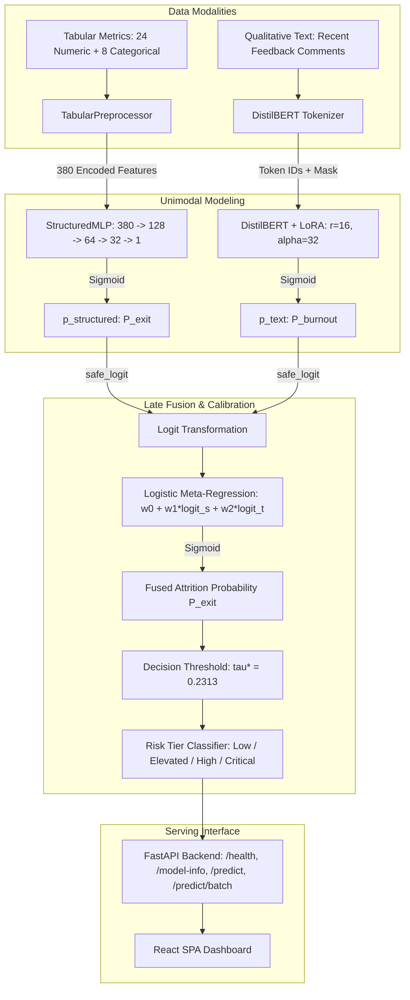

# Architecture Specification

This document details the software and machine learning architecture of the Sentinel Workforce Risk Platform.

---

## 1. System Overview

Sentinel processes two complementary modalities to evaluate workforce attrition risk:
1. **Structured Demographics and Organizational Telemetry**: Tabular numerical and categorical features processed by a PyTorch Multi-Layer Perceptron (StructuredMLP).
2. **Qualitative Employee Feedback**: Unstructured survey text analyzed by a fine-tuned DistilBERT model with Parameter-Efficient Fine-Tuning (LoRA).

Predictions from both branches are combined using a calibrated late-fusion meta-regression model that produces a final probability and risk tier.

---

## 2. Unimodal Branch Details

### 2.1 Tabular Structured Branch
- **Preprocessor (`TabularPreprocessor`)**:
  - Imputes missing numerical values with column medians.
  - Standardizes numerical features to zero mean and unit variance.
  - One-hot encodes categorical features with an unknown-category fallback.
  - Produces a dense 380-dimensional input vector.
- **Neural Network (`StructuredMLP`)**:
  - Architecture: `[380 -> 128 -> 64 -> 32 -> 1]`
  - Activations: `ReLU`, `BatchNorm1d`, `Dropout(0.20)`
  - Loss: Binary Cross-Entropy with Logits (`BCEWithLogitsLoss`)

### 2.2 Qualitative NLP Branch
- **Base Model**: `distilbert-base-uncased` (66M parameters).
- **LoRA Adapter (`PeftModel`)**:
  - Rank ($r$): 16
  - Scaling factor ($\alpha$): 32
  - Target modules: `q_lin`, `v_lin`
  - Dropout: 0.05
  - Trainable parameters: ~1.2% of total model weights (~3.55 MB adapter file).
- **Target**: High burnout distress indicator (`high_burnout_risk`).

---

## 3. Multimodal Late Fusion Mechanism

Rather than concatenating dense embeddings (early fusion), Sentinel uses late fusion over the calibrated unimodal log-odds:

$$\text{logit}(P_{\text{exit}}) = \beta_0 + \beta_1 \cdot \text{logit}(P_{\text{structured}}) + \beta_2 \cdot \text{logit}(P_{\text{burnout}})$$

Where:
- $\beta_0 = 0.0094$ (Intercept)
- $\beta_1 = 1.0471$ (Structured Weight)
- $\beta_2 = 0.0272$ (Text Weight)

A boundary-clamped logit function (`safe_logit`) prevents $\pm\infty$ values:

$$\text{safe\_logit}(p, \epsilon) = \ln\left(\frac{\max(\epsilon, \min(1-\epsilon, p))}{1 - \max(\epsilon, \min(1-\epsilon, p))}\right), \quad \epsilon = 10^{-6}$$

---

## 4. Decision Threshold & Risk Stratification

The default threshold $\tau^* = 0.2313$ was optimized on the holdout validation set to maximize recall for high-cost voluntary departures:

| Risk Tier | Probability Range | Operational Definition |
| :--- | :---: | :--- |
| **LOW** | $P < 0.2313$ | Standard retention monitoring; baseline risk profile. |
| **ELEVATED** | $0.2313 \le P < 0.45$ | Exceeds optimal decision threshold; early indicators present. |
| **HIGH** | $0.45 \le P < 0.70$ | Substantial risk of departure; requires management review. |
| **CRITICAL** | $P \ge 0.70$ | Acute departure and burnout risk; urgent retention intervention required. |

---

## 5. Serving Architecture

The application is structured as a unified full-stack web service:
- **Backend**: FastAPI running on Python 3.12 with asynchronous endpoints and Pydantic schema validation.
- **Frontend**: Single Page Application built with React 18, TypeScript, and Vite.
- **Static Mounting**: FastAPI serves the compiled `frontend/dist/` bundle at `/` and `/assets/*` for browser traffic while keeping JSON API routes distinct.
- **Predictor Lifecycle**: Models are initialized once in the FastAPI `lifespan` context and held in memory for single or batch predictions.
